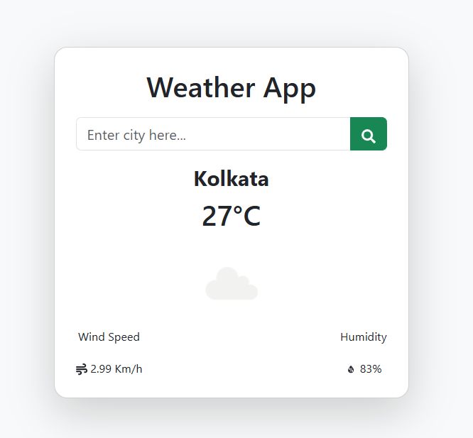

🌦️ Weather App

A modern and responsive Weather Application built using **React** and **Vite** that allows users to search for any city and view real-time weather information.

---

✨ Features

- 🔍 Search weather by city name
- 🌡️ Displays current temperature
- ☁️ Shows weather condition
- 💧 Displays humidity
- 💨 Shows wind speed
- 🌍 Real-time weather data
- 📱 Fully responsive design
- ⚡ Fast performance with Vite

---

🛠️ Tech Stack

- React
- Vite
- JavaScript
- HTML5
- CSS3
- OpenWeather API

---

## 📂 Project Structure

```
weather-app/
│── public/
│── src/
│   ├── assets/
│   ├── components/
│   ├── App.jsx
│   ├── App.css
│   └── main.jsx
│
├── .env
├── .gitignore
├── index.html
├── package.json
├── vite.config.js
└── README.md
```

---

## ⚙️ Installation

Clone the repository

```bash
git clone https://github.com/AvipshaKundu/weather-app.git
```

Navigate to the project

```bash
cd weather-app
```

Install dependencies

```bash
npm install
```

Start the development server

```bash
npm run dev
```

---

🔑 Environment Variables

Create a `.env` file in the root directory and add your API key.

```env
VITE_APP_ID=YOUR_OPENWEATHER_API_KEY


```

Get your free API key from:

https://openweathermap.org/api

---

📸 Screenshots

🏠 Home Page



---

👩‍💻 Author

**Avipsha Kundu**

GitHub: https://github.com/AvipshaKundu

---
